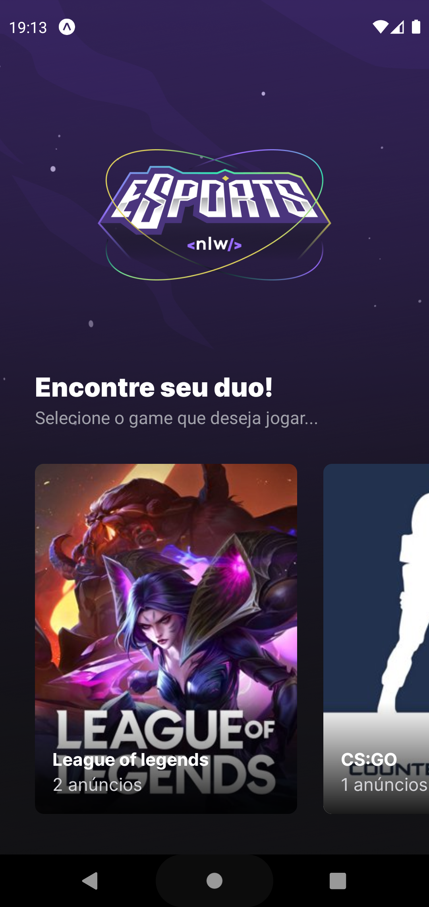
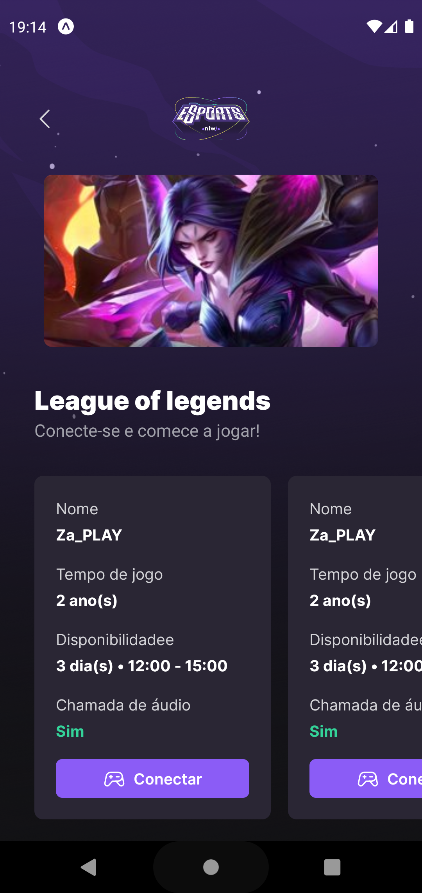
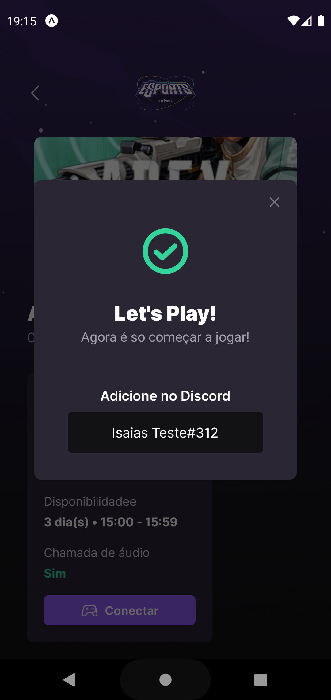
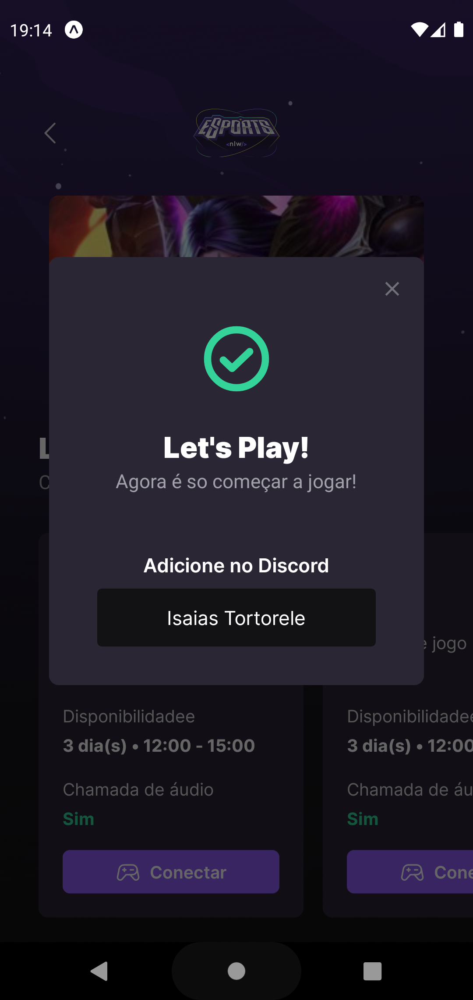
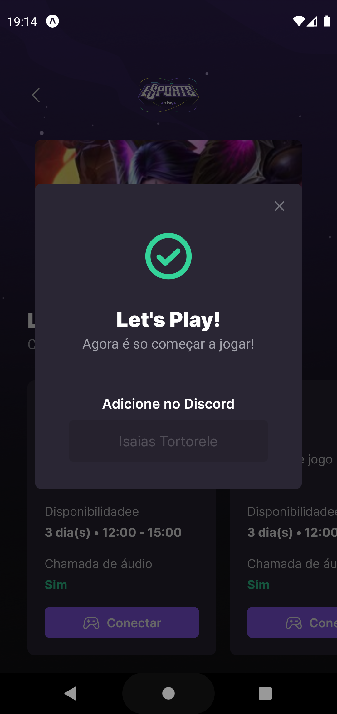
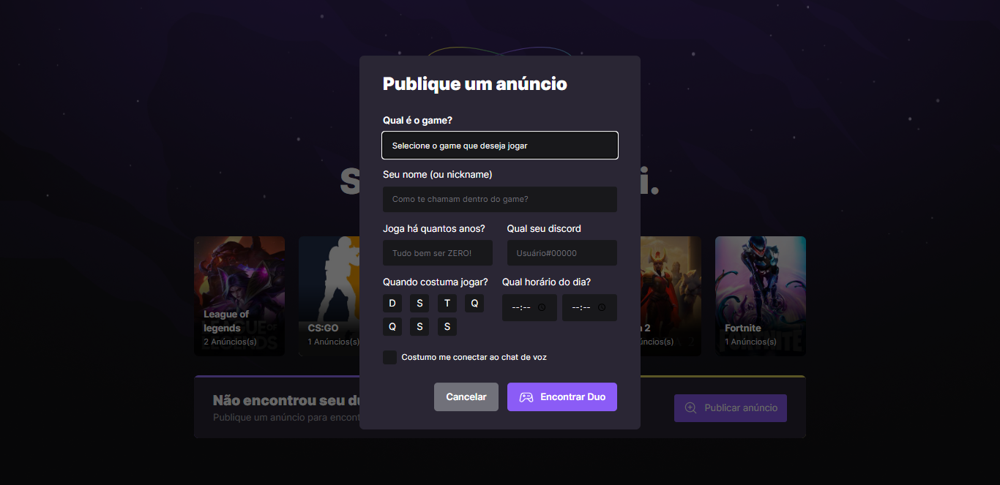

<h1 align="center">nlw-esports</h1>

## Descrição do Projeto

A aplicação consiste em usuários que quer encontrar um duo para jogar, criando anúncios 
com o seu jogo e o nome do Discord na esperança encontrar pessoas que jogam os mesmos jogos e se conecte no jogo.

### 🛠 Tecnologias

As seguintes ferramentas foram usadas na construção do projeto:

- [Expo](https://expo.io/)
- [Node.js](https://nodejs.org/en/)
- [React](https://pt-br.reactjs.org/)
- [React Native](https://reactnative.dev/)
- [TypeScript](https://www.typescriptlang.org/)

### Demonstração da aplicação

  
  
  
  
  

  
   
  

### Tecnologias
<h1 align="center">
    <a href="https://pt-br.reactjs.org/">🔗 React</a>
</h1>

🚀 Uma biblioteca JavaScript para criar interfaces de usuário

<h1 align="center">
    <a href="https://reactnative.dev/">🔗 React-Native</a>
</h1>

🚀  O React Native combina as melhores partes do desenvolvimento nativo com o React, 
a melhor biblioteca JavaScript da categoria para construir interfaces de usuário

<h1 align="center">
    <a href="https://nodejs.dev/en/learn/">🔗 NodeJS</a>
</h1>

🚀 O Node.js é um ambiente de tempo de execução JavaScript de código aberto e multiplataforma. 
É uma ferramenta popular para quase qualquer tipo de projeto!

### Contato
<a href="https://github.com/Isaias-Tortorele/">
 
  
 <b>Isaías Tortorele</b></a> <a href="https://blog.rocketseat.com.br/author/thiago//" title="Rocketseat">🚀</a>

Feito com ❤️ por Isaías Tortorele 👋🏽 Entre em contato!

 

